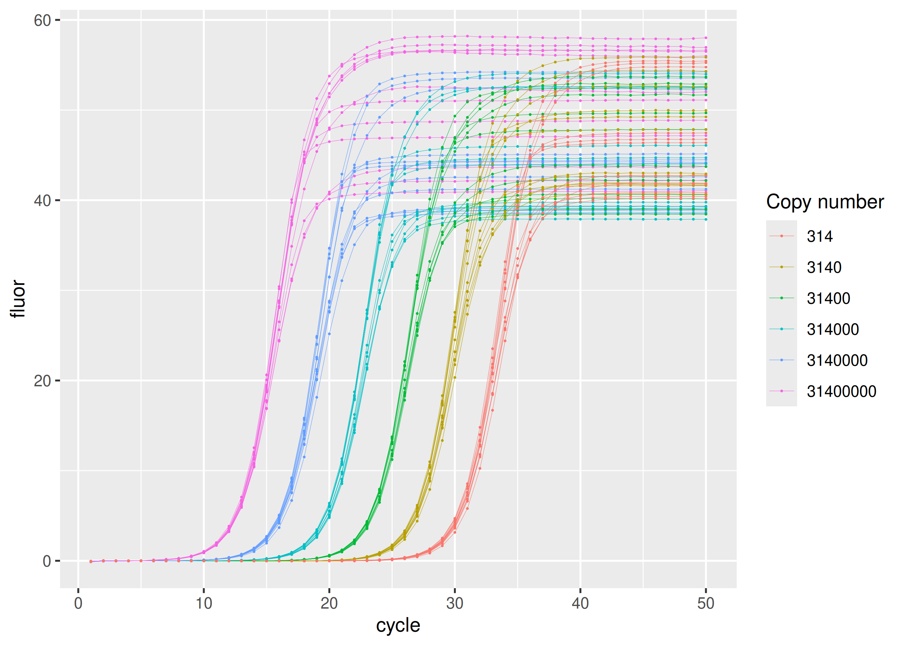
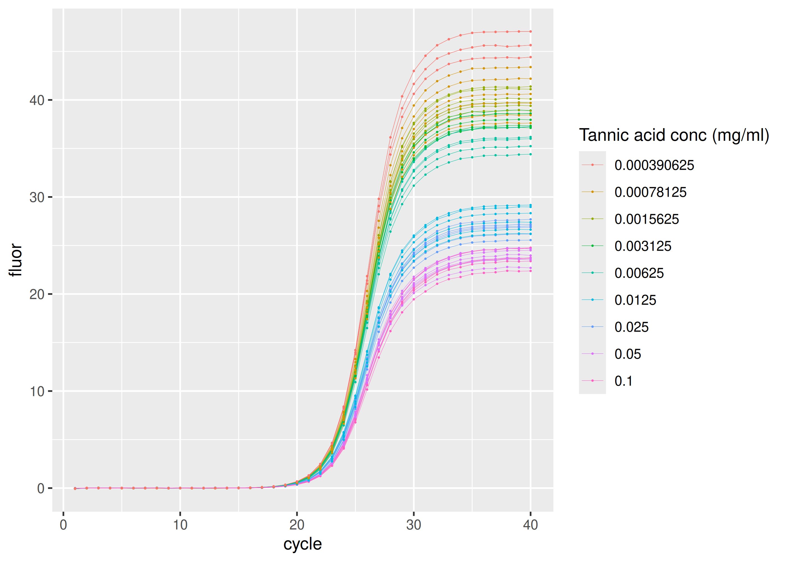
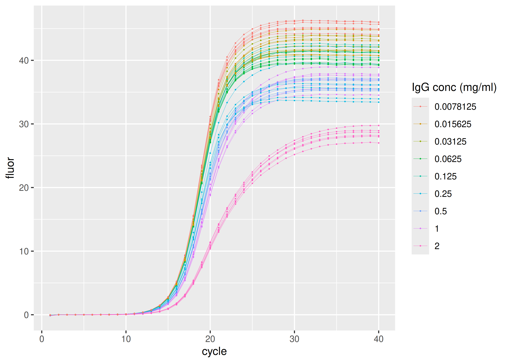

<!-- README.md is generated from README.Rmd. Please edit that file -->

# sisti

<!-- badges: start -->

[](https://CRAN.R-project.org/package=sisti)
[](https://github.com/ramiromagno/sisti/actions/workflows/R-CMD-check.yaml)
<!-- badges: end -->

`{sisti}` provides real-time PCR data sets by Sisti et al. (2010) in
tidy format.

## Installation

``` r
install.packages("sisti")
```

## Data

### Standard dilution series

``` r
library(ggplot2)
library(dplyr, warn.conflicts = FALSE)
library(sisti)

sisti |>
  dplyr::filter(plate == "calibration") |>
  ggplot(aes(
    x = cycle,
    y = fluor,
    group = interaction(replicate, copies),
    col = as.factor(copies)
  )) +
  geom_line(linewidth = 0.1) +
  geom_point(size = 0.05) +
  labs(color = "Copy number")
```



### Inhibition by tannic acid

``` r
sisti |>
  dplyr::filter(plate == "tannic acid") |>
  ggplot(aes(
    x = cycle,
    y = fluor,
    group = interaction(replicate, inhibitor_conc),
    col = as.factor(inhibitor_conc)
  )) +
  geom_line(linewidth = 0.1) +
  geom_point(size = 0.05) +
  labs(color = "Tannic acid conc (mg/ml)")
```



### Inhibition by IgG

``` r
sisti |>
  dplyr::filter(plate == "IgG") |>
  ggplot(aes(
    x = cycle,
    y = fluor,
    group = interaction(replicate, inhibitor_conc),
    col = as.factor(inhibitor_conc)
  )) +
  geom_line(linewidth = 0.1) +
  geom_point(size = 0.05) +
  labs(color = "IgG conc (mg/ml)")
```



### Inhibition by quercitin

``` r
sisti |>
  dplyr::filter(plate == "quercitin") |>
  ggplot(aes(
    x = cycle,
    y = fluor,
    group = interaction(replicate, inhibitor_conc),
    col = as.factor(inhibitor_conc)
  )) +
  geom_line(linewidth = 0.1) +
  geom_point(size = 0.05) +
  labs(color = "Quercitin conc (mg/ml)")
```


## Code of Conduct

Please note that the sisti project is released with a [Contributor Code
of Conduct](https://rmagno.eu/sisti/CODE_OF_CONDUCT.html). By
contributing to this project, you agree to abide by its terms.

## References

Davide Sisti, Michele Guescini, Marco BL Rocchi, Pasquale Tibollo, Mario
D’Atri and Vilberto Stocchi. *Shape based kinetic outlier detection in
real-time PCR*. BMC Bioinformatics 11:186 (2010). doi:
[10.1186/1471-2105-11-186](https://doi.org/10.1186/1471-2105-11-186).
