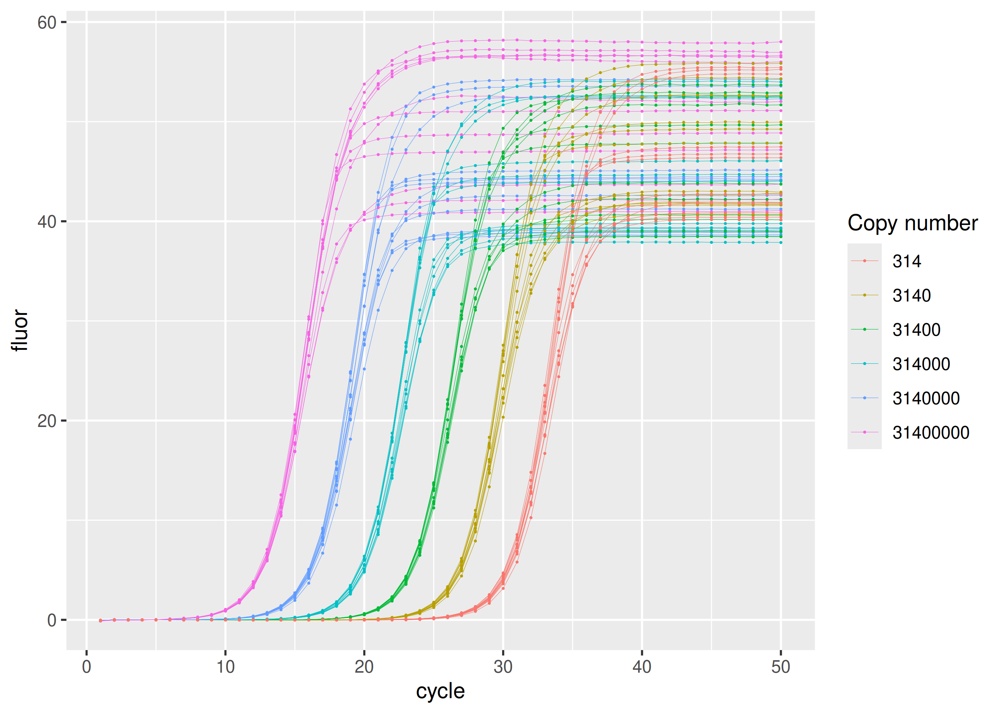
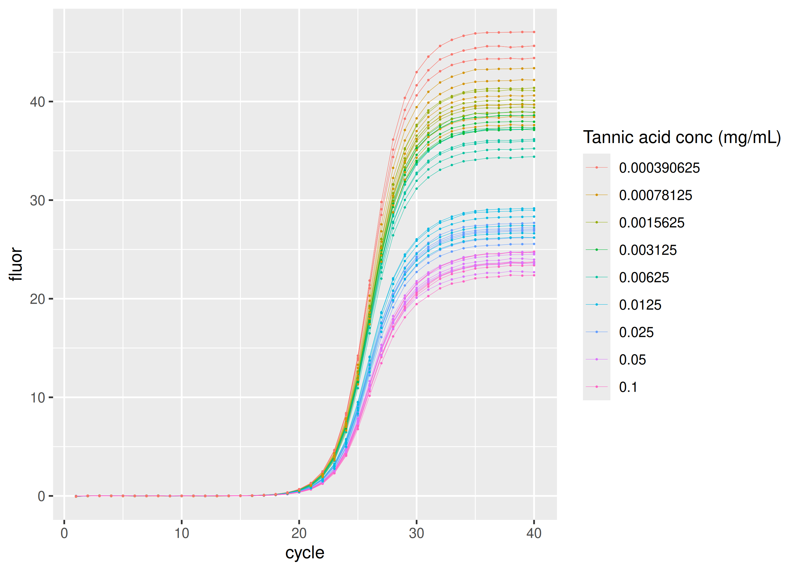
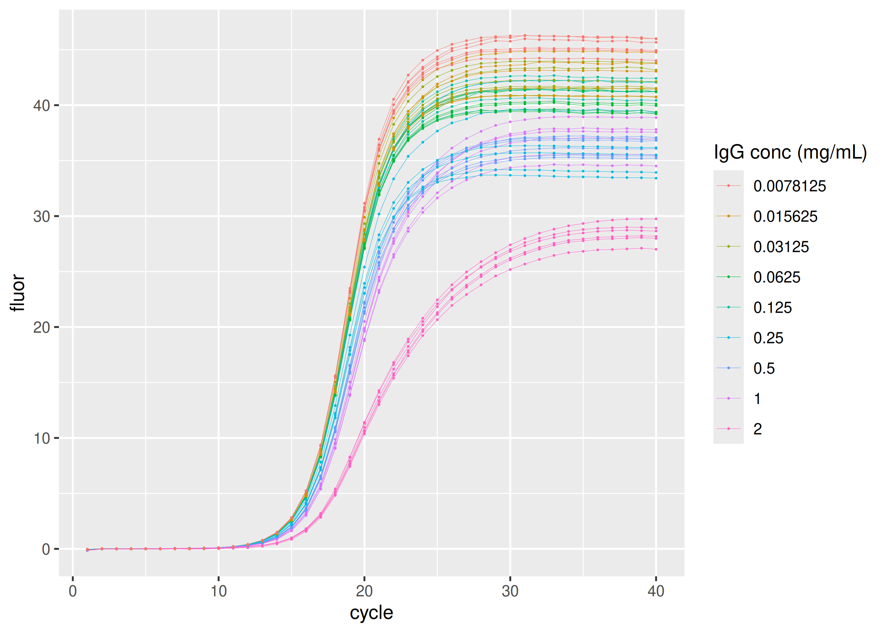
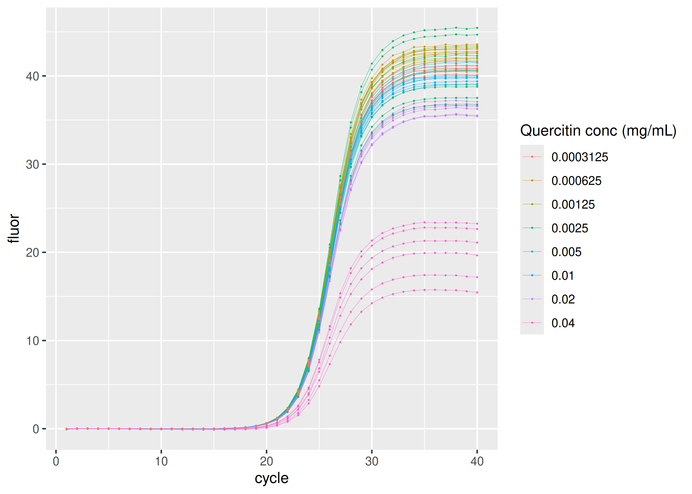

<!-- README.md is generated from README.Rmd. Please edit that file -->

# sisti

<!-- badges: start -->

[](https://CRAN.R-project.org/package=sisti)
[](https://github.com/ramiromagno/sisti/actions/workflows/R-CMD-check.yaml)
<!-- badges: end -->

`{sisti}` provides real-time PCR data sets by Sisti et al. (2010) in
tidy format as one single table (also named) `sisti`.

The primary dataset comprises a ten-fold dilution series spanning copy
numbers from $3.14 \times 10^7$ to $3.14 \times 10^2$, with twelve
replicates per concentration. These samples are based on a pGEM-T
Promega plasmid containing a 104 bp fragment of the mitochondrial gene
NADH dehydrogenase 1 (MT-ND1), amplified using the ND1/ND2 primer pair.
The remaining three datasets contain qPCR results in the presence of
specific PCR inhibitors: tannic acid, immunoglobulin G (IgG), and
quercetin, respectively, to assess their effects on the amplification
process.

Each original data set can be obtained by filtering `sisti` by `plate`
(see below).

## Installation

``` r
install.packages("sisti")
```

## Data

Each sample group is defined by the inhibitor (“none”, “tannic acid”,
“IgG” or “quercitin”), respective inhibitor concentration, and initial
amplicon copy number.

``` r
library(ggplot2)
library(dplyr, warn.conflicts = FALSE)
library(sisti)

sisti |>
  dplyr::distinct(plate, inhibitor, inhibitor_conc, copies, dilution) |>
  print(n = Inf)
#> # A tibble: 32 × 5
#>    plate       inhibitor   inhibitor_conc   copies dilution
#>    <fct>       <fct>                <dbl>    <int>    <int>
#>  1 calibration none              0        31400000        1
#>  2 calibration none              0         3140000       10
#>  3 calibration none              0          314000      100
#>  4 calibration none              0           31400     1000
#>  5 calibration none              0            3140    10000
#>  6 calibration none              0             314   100000
#>  7 tannic acid tannic acid       0.1         31400     1000
#>  8 tannic acid tannic acid       0.05        31400     1000
#>  9 tannic acid tannic acid       0.025       31400     1000
#> 10 tannic acid tannic acid       0.0125      31400     1000
#> 11 tannic acid tannic acid       0.00625     31400     1000
#> 12 tannic acid tannic acid       0.00312     31400     1000
#> 13 tannic acid tannic acid       0.00156     31400     1000
#> 14 tannic acid tannic acid       0.000781    31400     1000
#> 15 tannic acid tannic acid       0.000391    31400     1000
#> 16 IgG         IgG               2         3140000       10
#> 17 IgG         IgG               1         3140000       10
#> 18 IgG         IgG               0.5       3140000       10
#> 19 IgG         IgG               0.25      3140000       10
#> 20 IgG         IgG               0.125     3140000       10
#> 21 IgG         IgG               0.0625    3140000       10
#> 22 IgG         IgG               0.0312    3140000       10
#> 23 IgG         IgG               0.0156    3140000       10
#> 24 IgG         IgG               0.00781   3140000       10
#> 25 quercitin   quercitin         0.04        31400     1000
#> 26 quercitin   quercitin         0.02        31400     1000
#> 27 quercitin   quercitin         0.01        31400     1000
#> 28 quercitin   quercitin         0.005       31400     1000
#> 29 quercitin   quercitin         0.0025      31400     1000
#> 30 quercitin   quercitin         0.00125     31400     1000
#> 31 quercitin   quercitin         0.000625    31400     1000
#> 32 quercitin   quercitin         0.000312    31400     1000
```

Here is the number of replicates per group:

``` r
sisti |>
  dplyr::distinct(plate, inhibitor, inhibitor_conc, copies, dilution, replicate) |>
  dplyr::count(plate, inhibitor, inhibitor_conc, copies, dilution) |>
  print(n = Inf)
#> # A tibble: 32 × 6
#>    plate       inhibitor   inhibitor_conc   copies dilution     n
#>    <fct>       <fct>                <dbl>    <int>    <int> <int>
#>  1 calibration none              0             314   100000    12
#>  2 calibration none              0            3140    10000    12
#>  3 calibration none              0           31400     1000    12
#>  4 calibration none              0          314000      100    12
#>  5 calibration none              0         3140000       10    12
#>  6 calibration none              0        31400000        1    12
#>  7 IgG         IgG               0.00781   3140000       10     6
#>  8 IgG         IgG               0.0156    3140000       10     6
#>  9 IgG         IgG               0.0312    3140000       10     6
#> 10 IgG         IgG               0.0625    3140000       10     6
#> 11 IgG         IgG               0.125     3140000       10     6
#> 12 IgG         IgG               0.25      3140000       10     6
#> 13 IgG         IgG               0.5       3140000       10     6
#> 14 IgG         IgG               1         3140000       10     6
#> 15 IgG         IgG               2         3140000       10     6
#> 16 quercitin   quercitin         0.000312    31400     1000     6
#> 17 quercitin   quercitin         0.000625    31400     1000     6
#> 18 quercitin   quercitin         0.00125     31400     1000     6
#> 19 quercitin   quercitin         0.0025      31400     1000     6
#> 20 quercitin   quercitin         0.005       31400     1000     6
#> 21 quercitin   quercitin         0.01        31400     1000     6
#> 22 quercitin   quercitin         0.02        31400     1000     6
#> 23 quercitin   quercitin         0.04        31400     1000     6
#> 24 tannic acid tannic acid       0.000391    31400     1000     6
#> 25 tannic acid tannic acid       0.000781    31400     1000     6
#> 26 tannic acid tannic acid       0.00156     31400     1000     6
#> 27 tannic acid tannic acid       0.00312     31400     1000     6
#> 28 tannic acid tannic acid       0.00625     31400     1000     6
#> 29 tannic acid tannic acid       0.0125      31400     1000     6
#> 30 tannic acid tannic acid       0.025       31400     1000     6
#> 31 tannic acid tannic acid       0.05        31400     1000     6
#> 32 tannic acid tannic acid       0.1         31400     1000     6
```

### Standard dilution series

Most concentrated set of samples in the dilution series have
$3.14 × 10^7$ copies of the NADH dehydrogenase 1 (MT-ND1) amplicon.
Following samples in the series are ten-fold dilutions.

``` r
sisti |>
  dplyr::filter(plate == "calibration") |>
  ggplot(aes(
    x = cycle,
    y = fluor,
    group = interaction(replicate, copies),
    col = as.factor(copies)
  )) +
  geom_line(linewidth = 0.1) +
  geom_point(size = 0.05) +
  labs(color = "Copy number")
```



### Inhibition by tannic acid

``` r
sisti |>
  dplyr::filter(plate == "tannic acid") |>
  ggplot(aes(
    x = cycle,
    y = fluor,
    group = interaction(replicate, inhibitor_conc),
    col = as.factor(inhibitor_conc)
  )) +
  geom_line(linewidth = 0.1) +
  geom_point(size = 0.05) +
  labs(color = "Tannic acid conc (mg/mL)")
```



### Inhibition by immunoglobulin G (IgG)

``` r
sisti |>
  dplyr::filter(plate == "IgG") |>
  ggplot(aes(
    x = cycle,
    y = fluor,
    group = interaction(replicate, inhibitor_conc),
    col = as.factor(inhibitor_conc)
  )) +
  geom_line(linewidth = 0.1) +
  geom_point(size = 0.05) +
  labs(color = "IgG conc (mg/mL)")
```



### Inhibition by quercitin

``` r
sisti |>
  dplyr::filter(plate == "quercitin") |>
  ggplot(aes(
    x = cycle,
    y = fluor,
    group = interaction(replicate, inhibitor_conc),
    col = as.factor(inhibitor_conc)
  )) +
  geom_line(linewidth = 0.1) +
  geom_point(size = 0.05) +
  labs(color = "Quercitin conc (mg/mL)")
```



## Code of Conduct

Please note that the sisti project is released with a [Contributor Code
of Conduct](https://rmagno.eu/sisti/CODE_OF_CONDUCT.html). By
contributing to this project, you agree to abide by its terms.

## References

Davide Sisti, Michele Guescini, Marco BL Rocchi, Pasquale Tibollo, Mario
D’Atri and Vilberto Stocchi. *Shape based kinetic outlier detection in
real-time PCR*. BMC Bioinformatics 11:186 (2010). doi:
[10.1186/1471-2105-11-186](https://doi.org/10.1186/1471-2105-11-186).
